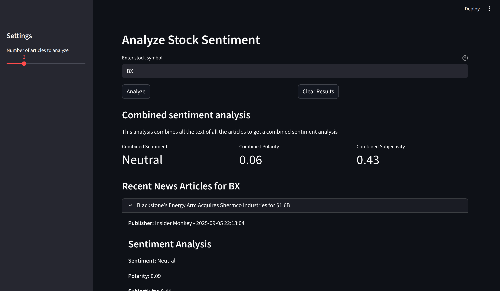

# News Sentiment Analysis

## Overview

The **News Sentiment Analysis** project is a tool that analyzes the sentiment of recent news articles related to a specific stock ticker. It uses natural language processing (NLP) techniques to determine the sentiment (positive, negative, or neutral), polarity, and subjectivity of news articles.

  

## Features

- **Stock Sentiment Analysis**: Analyze the sentiment of news articles for a given stock ticker.
- **Headline and Full-Text Analysis**: Perform sentiment analysis on both headlines and full article text (if available).
- **Combined Sentiment**: Aggregate sentiment analysis across all articles for a comprehensive view.
- **Interactive Dashboard**: A user-friendly interface built with Streamlit for visualizing sentiment metrics.

## Tech Used

- **Python**: Core programming language.
- **Streamlit**: For building the interactive web-based dashboard.
- **TextBlob**: For sentiment analysis and NLP tasks.
- **yFinance**: For fetching stock-related news articles.
- **Pandas**: For data manipulation and analysis.

## To Use:

- Set up a virtual environment:

    `python3 -m venv venv`
    `source venv/bin/activate`

- Install requirements:

    `pip install -r requirements.txt`

- Run the app:

    `streamlit run main.py`
